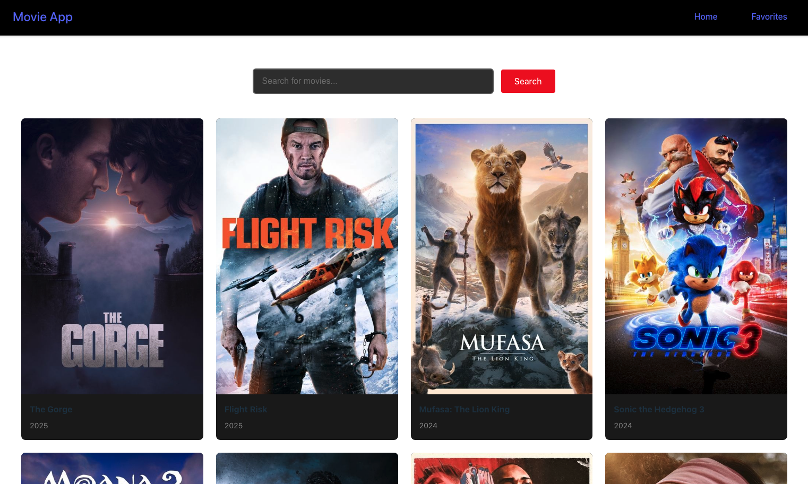
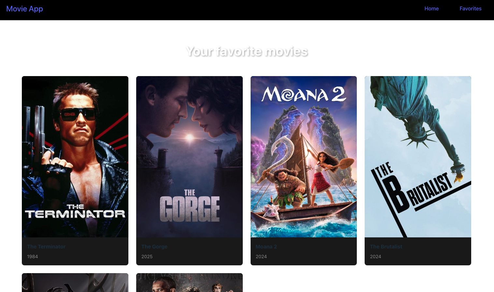

# React Movie App

This is a simple movie app built with React that allows users to search for movies, view popular movies, and manage a list of favorite movies. The app uses The Movie Database (TMDb) API to fetch movie data and allows users to add/remove movies from their favorites list.

## Features

- **Search for Movies**: Users can search for movies by title and view results in real-time.
- **Popular Movies**: Display a list of popular movies fetched from The Movie Database API.
- **Favorites List**: Users can add movies to their favorites list and remove them. The favorites list is saved in localStorage, so it's persisted even after refreshing the page.
- **Responsive Design**: The app is fully responsive and optimized for both desktop and mobile devices.

## Screenshots

### Home Page

### Favorites Page

